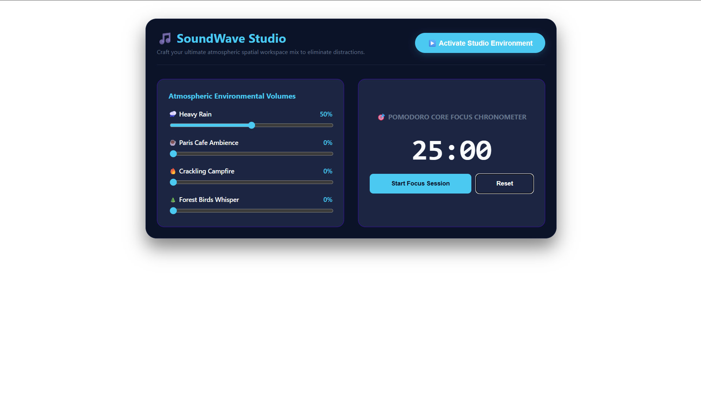

#  SoundWave — Interactive Ambient Mixing Studio & Pomodoro Timer
---------------------------------------------------------------------------------------------
SoundWave is an advanced developer focus utility engineered with React. It leverages native browser memory architecture via `useRef` to drive multiple audio pipelines concurrently, offering custom ambient noise balancing sliders mapped with an optimized asynchronous Pomodoro focus tracker.
------------------------------------------------------------------------------------------------
## Preview 

## Architectural Structural Details
*  **Persistent Background Audio Hooks:** Employs explicit React `useRef` instances to lock HTML5 Audio instances securely outside normal component render loops to avoid clipping.
*  **Asynchronous State Synchronization:** Handles multi-layered `useEffect` listeners to manage ticking intervals alongside runtime media adjustments seamlessly.
-------------------------------------------------------------------------------------------------
##  Running Instructions
1. Install packages: `npm install`
2. Run ecosystem: `npm run dev`
-----------------------------------------------------------------------------------------------
